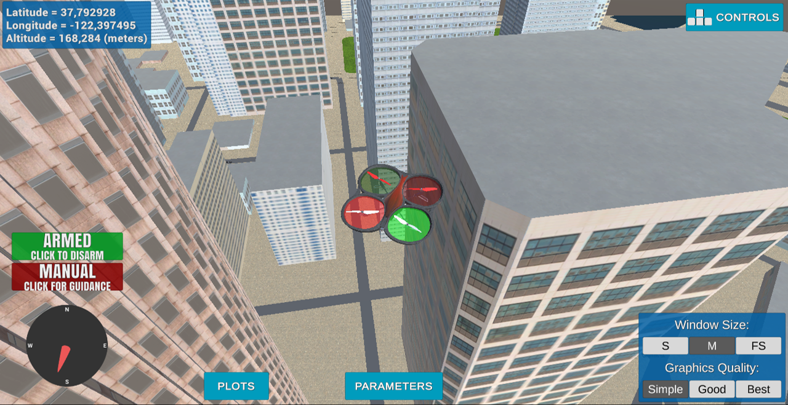
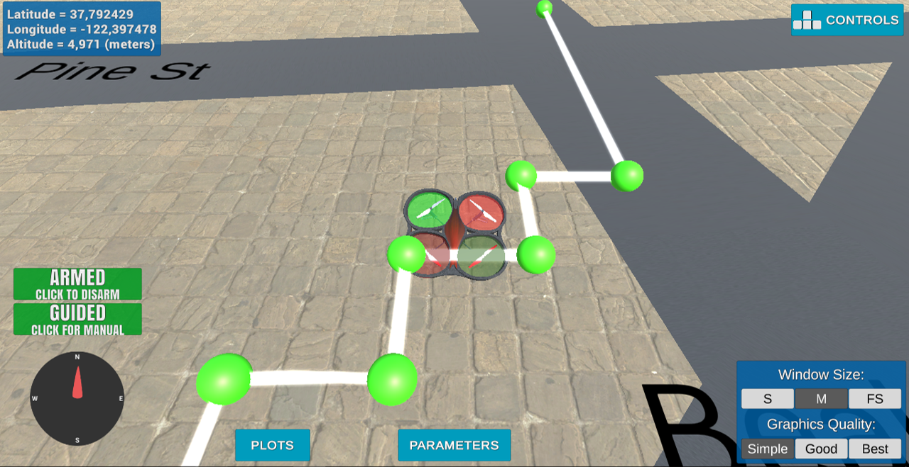
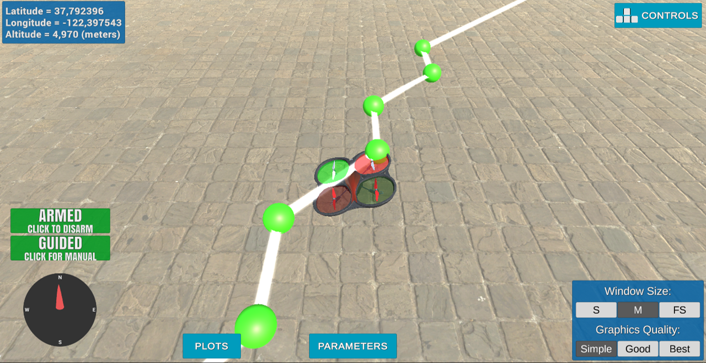
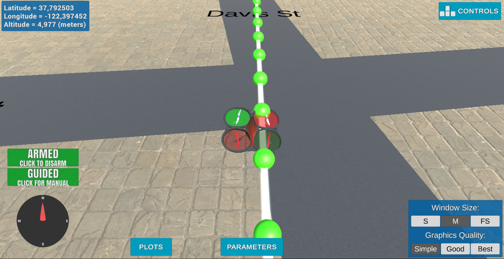
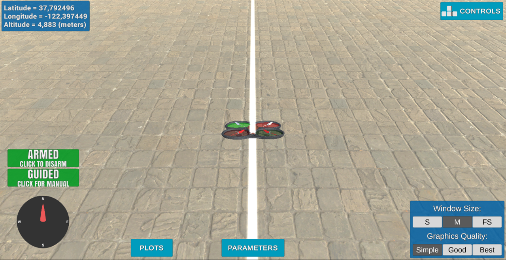

## Project: 3D Motion Planning

### Explain the Starter Code

In the backyard_flyer code, the drone follow a square path, where the waypoints are discribed in this variable:
self.waypoints = [[10.0, 0.0, 3.0], [10.0, 10.0, 3.0], [0.0, 10.0, 3.0], [0.0, 0.0, 3.0]]. 
The backyard_flyer code define 6 transitions: MANUAL, ARMING, TAKEOFF, WAYPOINT, LANDING and DISARMING. Before arming, the initial state of the drone is MANUAL, at the end and after disarming, it return to MANUAL state. Below a description of what the drone do exactly in each state:
#### 1. ARMING: arming --> spinning the rotors
#### 2. TAKEOFF: take off to 3 meter of altitude
#### 3. WAYPOINT: if the drone reaches the target altitude (3 meters in this case), it changes its position to the first waypoint, then the second and so on until it doen't still any waypoint to follow in the table self.waypoints. In this case the drone change the state to LANDING.
#### 4. LANDING: the drone changes its altitude from 3 meters to 0.
#### 5. DISARMING: the rotors stop spinning.

The motion_planning code (and planning_utils code where most of functions are described) differ from the backyard_code in the path followed by the drone after TAKEOFF. The drone doesn't follow a square path described by 4 waypoints, it modelize the navigation environnement as a grid and try to calculate the shortest path evoiding the colliders from a starter point to an end point. This is modelized in the code by adding a state called PLANNING befor TAKEOFF. So what the drone do exactly in this case is:
#### 1. ARMING: arming --> spinning the rotors
#### 2. PLANNING: modelize the navigation environnement by reading the file colliders.csv and the calculate a path from a starting point to an end point using A* algorithm and store the waypoints in the variable self.waypoints.
#### 2. TAKEOFF: take off to 5 meter of altitude
#### 3. WAYPOINT: if the drone reaches the target altitude (5 meters in this case), it changes its position to the first waypoint, then the second and so on until it doen't still any waypoint to follow in the table self.waypoints. In this case the drone change the state to LANDING.
#### 4. LANDING: the drone changes its altitude from 5 meters to 0.
#### 5. DISARMING: the rotors stop spinning.

### Implementing Your Path Planning Algorithm

#### 1. Set your global home position
The global position is given in the first line of colliders.csv file. So, to read this line, I used the 'with' statement because it read the file and then it colose it. The 'first_line' is returned as string, so I used string class methods to extract the lat0 and lon0. Then, I used 'self.set_home_position()' method to set global home. 

And here is a lovely picture of our downtown San Francisco environment from above!

#### 2. Set your current local position
After extracting the global position in the first task, I used the attributes below to retrieve the global home position:
* self.\_longitude 
* self.\_latitude
* self.\_altitude
Then, I used the method "global_to_local" to convert this position from geodetic frame to NED frame.

#### 3. Set grid start position from local position
This is simply done by adding the local position to the map center as follow:
grid_start = (int(-north_offset - self.local_position[0]), int(-east_offset - self.local_position[1]))

#### 4. Set grid goal position from geodetic coords
This is done by defining two new attributes:
- self.global_goal : the desired destination expressed in geodetic frame 
- self.local_goal : the converted goal position to the NED frame
The rest is similar with what's done with the start position: use of the method 'global_to_local' to convert the 'self.global_goal' to 'self.local_goal' and adding of this variable to the map center as follow:
grid_goal = (int(-north_offset - self.local_goal[0]), int(-east_offset - self.local_goal[1]))

#### 5. Modify A* to include diagonal motion (or replace A* altogether)
This is done in the planning_utils.py file. The modified method is 'valid_actions'. The modification relies on adding four new diagonal actions with cost sqrt(2) and then adding the check of validity as done for the main four actions NORTH, SOUTH, EAST and WEST:
    DWN = (-1, -1, np.sqrt(2))	---> Diagonal West North
    DWS = (1, -1, np.sqrt(2))	---> Diagonal West South
    DEN = (-1, 1, np.sqrt(2))	---> Diagonal East North
    DES = (1, 1, np.sqrt(2))	---> Diagonal East South
And here's the path planned before and after adding the diagonal actions.
BEFORE -->

AFTER -->

#### 6. Cull waypoints 
For this task, I used collinearity check by adding three methods: 'point', 'collinearity_check' and 'prune_path'. the collinearity check is based on calculating the 'det' of three points and check whether it is lower than epsilon.
To test this, I choose a straight path and I executed the code with and without the prune test. The testshows that after adding the 'prune_path' method, it remains only the start and goal waipoints.
Here's two photos showing this test:
BEFORE adding prune_path -->

AFTER adding prune_path -->

### Execute the flight
#### 1. Does it work?
It works!
Here's how the drone follow the path:

